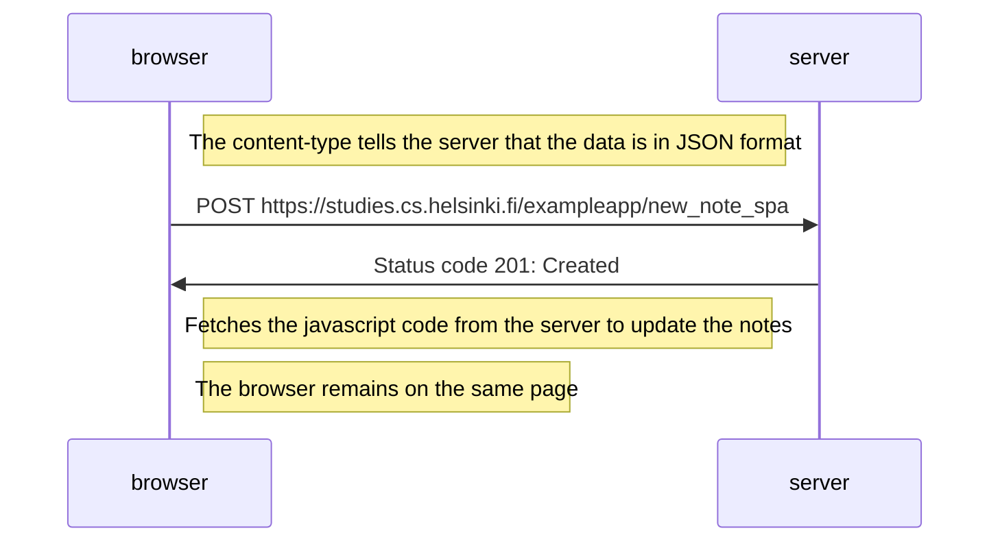

```mermaid
sequenceDiagram

  participant browser
  participant server

    note right of browser: The content-type tells the server that the data is in JSON format

    browser->>server: POST https://studies.cs.helsinki.fi/exampleapp/new_note_spa
    server->>browser: Status code 201: Created

    note right of browser: Fetches the javascript code from the server to update the notes
    note right of browser: The browser remains on the same page


```